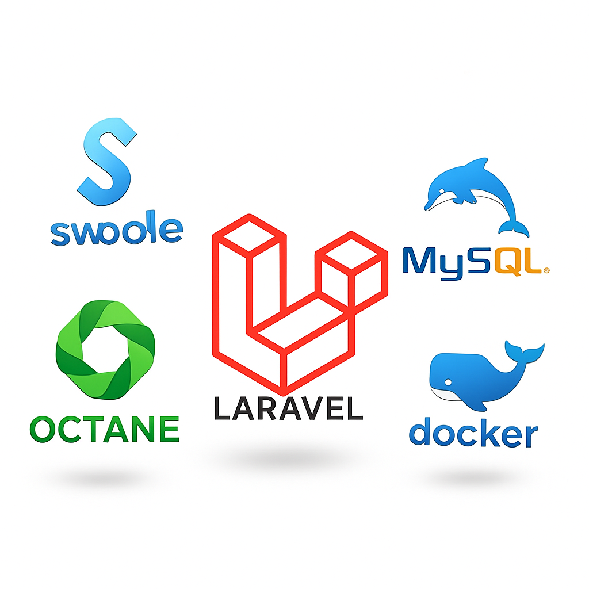

# Laravel Mysql Pooling Connection Demo

[

A demonstration project that showcases how to implement and benchmark a high-performance MySQL connection pool in 
a **Laravel** application using **Swoole** and **Laravel Octane**.

## 📖 Table of Contents

* [💡The Problem](#-the-problem)
* [🚀Key Features](#-key-features)
* [Getting Started](#-getting-started)
* [🧪Performance Testing](#-performance-testing)
* [📂File Structure](#-file-structure)


***

## 💡 The Problem

Traditional PHP applications open a new TCP connection to the database for every single HTTP request. This process of creating, authenticating, and closing a connection has significant overhead, which can become a major bottleneck under high traffic.

This project demonstrates how a **connection pool**  solves this problem by maintaining a set of open, ready-to-use connections that are shared across multiple requests.

***

## 🚀 Key Features

* **Swoole Integration:** Utilizes the Swoole PHP extension and its coroutine-based MySQL client for asynchronous, non-blocking I/O.
* **Performance Comparison:** Includes two distinct endpoints to directly compare a classic Laravel database connection against a coroutine-based connection pool.
* **Docker Support:** The entire environment, including the application and MySQL database, is containerized using `docker-compose` for easy setup and reproducibility.
* **Performance Testing:** Provides instructions for load testing with `wrk` to measure the difference in requests per second and latency.

***

## 💻 Getting Started

Clone the repository and set up your environment with a single command. Make sure you have Docker and Docker Compose installed.

1.  Clone the repository:
    `git clone https://github.com/boiar/laravel-mysql-pooling-demo.git`
2.  Navigate to the project directory:
    `cd laravel-mysql-pooling-demo`
3.  Start the Docker containers (this will build the application image and start the MySQL database):
    `docker-compose up --build -d`

***

## 🧪 Performance Testing

To see the performance difference, use a load testing tool like **wrk** on your local machine.

1.  Install `wrk` (e.g., `brew install wrk` on macOS or `sudo apt-get install wrk` on Debian/Ubuntu).

2.  Run the tests against the two endpoints. We'll simulate 100 concurrent connections for 30 seconds.

    * **Test without the connection pool:**
      `wrk -t4 -c100 -d30s http://127.0.0.1:8000/posts-count-without-pool`
    * **Test with the connection pool:**
      `wrk -t4 -c100 -d30s http://127.0.0.1:8000/posts-count-with-pool`

    You should see a dramatic increase in **Requests/sec** and a significant drop in **Latency** for the pooling method.

***

## 📂 File Structure
```
│
├── docker-compose.yml
├── Dockerfile
└── src  // Laravel app files
```